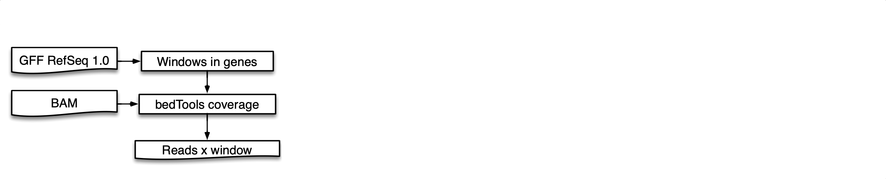
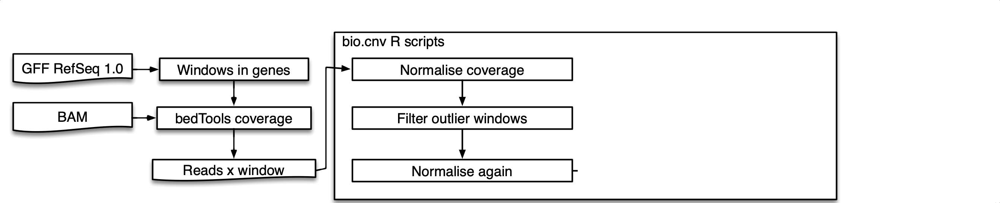
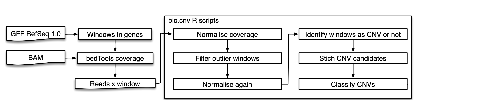

# Detection of medium and large CNV

Objective

- To find medium and large Copy Number Variation (CNV)


```{r, message=FALSE, echo=FALSE}

params<-list()
params$data_path <- "~/Documents/WatSeq/Deletions/20200724/200bp/"
params$gff_file <- "~/Dropbox/JIC/WatSeq/Annotation/Triticum_aestivum.IWGSC.41.parts.tidy.gff3.gz"
params$gene_in_detail <- "TraesCS4D02G040100"


library(devtools)
library(knitr)
#library(GenomicRanges)
library(GenomicFeatures)
library(RSQLite)
library(ggbio)
library(plyr)
library(rtracklayer)
load_all("../bio.cnv/R", TRUE)
gff  <- import(params$gff_file)

seq_len=paste0(params$data_path, "sequence_lengths.txt")
#levels <- c("chr1A","chr1B", "chr1D","chr2A","chr2B", "chr2D","chr3A","chr3B", "chr3D","chr4A","chr4B", "chr4D","chr5A","chr5B", "chr5D","chr6A","chr6B", "chr6D","chr7A","chr7B", "chr7D","chrUn")
lens <- read.csv(seq_len, sep="\t", stringsAsFactors=F)
levels <- lens$seqname
lens$seqname<-factor(lens$seqname, levels = levels)

covs_db = dbConnect(drv=RSQLite::SQLite(), dbname="~/Documents//WatSeq/Deletions/20200724/200bp/long_tables/covs_200bp.db")
gene_region <- gff[gff$gene_id %in% c(params$gene_in_detail)]
cov_in_range <- getWindowsInRange(covs_db, region=gene_region)
```


# Initial data 

{ width=100% }

```{r, message=FALSE, echo=FALSE}
mat <- read.csv("./examples/mock_for_presentation.csv",)
rownames(mat) <- mat[,1]
mat[,1] <- NULL
data_df <- getExonsDF(mat)
kable(mat)

```

## Initial data 

```{r, message=FALSE, echo=FALSE, fig.width=10, fig.height=5}

p <- plotLibraryOnChromosomeInterval(cov_in_range, lines=c(), col="cov", title = "Original coverage" ) + coord_cartesian(ylim=c(0,60)) 
p <- p + theme(legend.position="bottom")
p
```

> - Coverage across regions a region is not uniform

# Normalisation

{ width=100% }

$x_{i,j}=\frac{WindowCoverage_{i,j}\times10^{9}}{WindowLength_{i}\times{totalReadsSample_{j}}}$

$xnorm_{i,j}=\frac{x_{i,j}}{mean(X_{i})}$


## Normalise by sample

$x_{i,j}=\frac{WindowCoverage_{i,j}\times10^{9}}{WindowLength_{i}\times{totalReadsSample_{j}}}$
```{r, message=FALSE, echo=FALSE}

. . . 

totalReadsPerSample<-apply(mat,2,sum, na.rm=T)
tmp_mat <- rbind(mat, totalReadsPerSample) 
rownames(tmp_mat)[6] <- "totalReadsSample"
kable(tmp_mat)
```

## Normalisation by window 

$xnorm_{i,j}=\frac{x_{i,j}}{mean(X_{i})}$

. . . 

```{r, message=FALSE, echo=FALSE}
multiplier<-outer(data_df$ExonL, totalReadsPerSample )
multiplier<-1/multiplier
multiplier<-1000000000*multiplier
#"RPKM-like covs"
multiplier<-mat*multiplier
mean.mult <- apply(multiplier, 1, mean, na.rm = T)
tmp_mat <- cbind(multiplier, mean.mult ) 
colnames(tmp_mat)[5] <- "Window Mean"
kable(tmp_mat)
#kable(multiplier)
```

## Normalised coverage

```{r, message=FALSE, echo=FALSE}
covs<-sweep(multiplier,MARGIN=1,mean.mult,'/')
kable(covs)
```

## Normalised coverage

```{r, message=FALSE, echo=FALSE, fig.width=11, fig.height=3}
p <- plotLibraryOnChromosomeInterval(cov_in_range, lines=c(), col="cov", title = "Original coverage" ) + coord_cartesian(ylim=c(0,60)) 
p <- p + theme(legend.position="bottom")
p
```

. . . 

```{r, message=FALSE, echo=FALSE, fig.width=11, fig.height=3}
p <- plotLibraryOnChromosomeInterval(cov_in_range, lines=c(), col="norm_cov", title = "Normalised coverage" ) + coord_cartesian(ylim=c(0,2)) 
p <- p + theme(legend.position="bottom")
p
```


## Second normalisation

> - Remove the windows with $sd(window) > 0.3) $
> - Remove the lines with high variation $sd(line) > 0.5 $
> - Repeat normalisation  
> - Exclude the datapoints with "0"

## Effect of removing the noisy lines  


## Identifiy windows with CNV 

covs_

## Stich CNV candidates 
data


## Classify CNVs
echo

# CNV candidates

{ width=100% }


