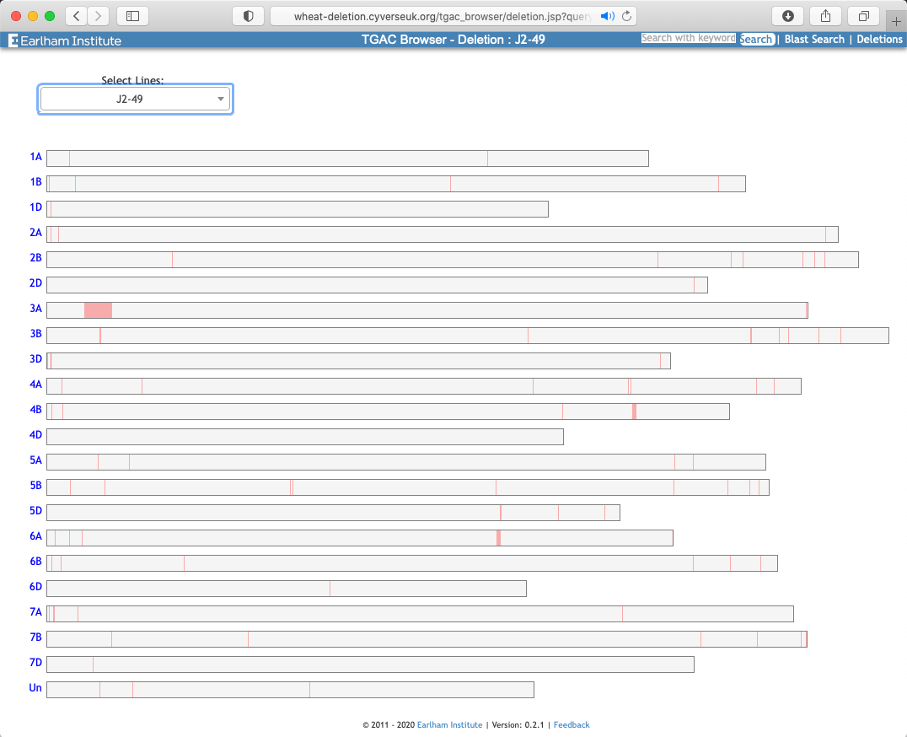

# Deletions in 𝛾-radiation lines
```{r, message=FALSE, echo=FALSE, warning=FALSE}

suppressWarnings({
library(ggplot2)
library(sqldf)
library(reshape2)
library(ggbio)
library(GenomicRanges)
library(GenomicFeatures)
library(rtracklayer)
library(gridExtra)
library(grid)
    #require("bio.tilling")
source('./extra_scripts/plot_skim.r', chdir = TRUE)
})


params <- list()

params$skim.path <- "/Users/ramirezr/Dropbox/JIC/Skim"

seq.len.refseq.path  <- paste0(params$skim.path, "/WGAv1.0/sequence_lengths.txt")
levs <- c("chr1A","chr1B", "chr1D","chr2A","chr2B", "chr2D","chr3A","chr3B", "chr3D","chr4A","chr4B", "chr4D","chr5A","chr5B", "chr5D","chr6A","chr6B", "chr6D","chr7A","chr7B", "chr7D","chrUn")
seq.len.refseq <- read.csv(seq.len.refseq.path, sep="\t", stringsAsFactors=F)
seq.len.refseq$seqname<-factor(seq.len.refseq$seqname, levels = levs)
rownames(seq.len.refseq) <- seq.len.refseq$seqname

gff.path=paste0(params$skim.path, "/WGAv1.0//Triticum_aestivum.IWGSC.43.chr.gff3.gz")
gff.e43 <- import(gff.path)
seqlengths(gff.e43) <- seq.len.refseq[levels(seqnames(gff.e43)),"length"]

rds.path <- paste0(params$skim.path, "/notebook/Tables/all_dels_test_d1000_200k_to_10k_gap_3.rds")
dels_d1000_g3 <- readDelsRDS(path=rds.path, lens=seq.len.refseq.path)

# plot_deletions_in_region(dels_d1000_g3, 
#                           chr="chr3A", 
#                           start= 32000000,
#                           end  = 68000000,
#                           line="J2.49_k80d50Mc5", window_sizes = c("050k")) 

 
```


> - ~600 Paragon lines with radiation induced deletions 
> - Low sequencing coverage (0.3x)
> - Identify lines with missing genes to test changes in phenotype
> - Large window sizes to make up for low coverage

## Normalised coverage in a line and region 

```{r,  message=FALSE, echo=FALSE, warning=FALSE}
chr <-   "chr3A"
start <- 32000000
endd   <- 68000000
line <-  "J2.49_k80d50Mc5"
plot_deletions_in_region(dels_d1000_g3, 
                          chr=chr, 
                          start= start,
                          end  = endd,
                          line=line, plot_validated = FALSE, 
                          colors=c("200k"="#1b9e7700",
                                             "100k"="#d95f0200",
                                             "075k"="#7570b300",
                                             "050k"="#e7298a00",
                                             "025k"="#66a61eFF",
                                             "010k"="#e6ab0200",
                                             "Hom"="#8c510a",
                                             "Het"="#01665e", 
                                             "TRUE"="#cc8131",
                                             "FALSE"="#cdE5e5")
                         )
```

## Normalised coverage in a line and region 

```{r,  message=FALSE, echo=FALSE, warning=FALSE}
plot_deletions_in_region(dels_d1000_g3, 
                          chr=chr, 
                          start= start,
                          end  = endd,
                          line=line, plot_validated = FALSE,
                          colors=c("200k"="#1b9e7700",
                                             "100k"="#d95f0200",
                                             "075k"="#7570b300",
                                             "050k"="#e7298aFF",
                                             "025k"="#66a61e30",
                                             "010k"="#e6ab0200",
                                             "Hom"="#8c510a",
                                             "Het"="#01665e", 
                                             "TRUE"="#cc8131",
                                             "FALSE"="#cdE5e5"))
```

## Normalised coverage in a line and region 


```{r,  message=FALSE, echo=FALSE, warning=FALSE}
plot_deletions_in_region(dels_d1000_g3, 
                          chr=chr, 
                          start= start,
                          end  = endd,
                          line=line, plot_validated = FALSE,
                          colors=c("200k"="#1b9e7700",
                                             "100k"="#d95f0200",
                                             "075k"="#7570b3FF",
                                             "050k"="#e7298a30",
                                             "025k"="#66a61e30",
                                             "010k"="#e6ab0200",
                                             "Hom"="#8c510a",
                                             "Het"="#01665e", 
                                             "TRUE"="#cc8131",
                                             "FALSE"="#cdE5e5"))
```

## Normalised coverage in a line and region 

```{r,  message=FALSE, echo=FALSE, warning=FALSE}
plot_deletions_in_region(dels_d1000_g3, 
                          chr=chr, 
                          start= start,
                          end  = endd,
                          line=line, plot_validated = FALSE,
                          colors=c("200k"="#1b9e7700",
                                             "100k"="#d95f02FF",
                                             "075k"="#7570b330",
                                             "050k"="#e7298a30",
                                             "025k"="#66a61e30",
                                             "010k"="#e6ab0200",
                                             "Hom"="#8c510a",
                                             "Het"="#01665e", 
                                             "TRUE"="#cc8131",
                                             "FALSE"="#cdE5e5"))
```

## Normalised coverage in a line and region 

```{r,  message=FALSE, echo=FALSE, warning=FALSE}
plot_deletions_in_region(dels_d1000_g3, 
                          chr=chr, 
                          start= start,
                          end  = endd,
                          line=line, plot_validated = FALSE,
                          colors=c("200k"="#1b9e77FF",
                                             "100k"="#d95f0230",
                                             "075k"="#7570b330",
                                             "050k"="#e7298a30",
                                             "025k"="#66a61e30",
                                             "010k"="#e6ab0200",
                                             "Hom"="#8c510a",
                                             "Het"="#01665e", 
                                             "TRUE"="#cc8131",
                                             "FALSE"="#cdE5e5"))
```

## Normalised coverage in a line and region 

```{r,  message=FALSE, echo=FALSE, warning=FALSE}
plot_deletions_in_region(dels_d1000_g3, 
                          chr=chr, 
                          start= start,
                          end  = endd,
                          line=line, 
                          colors=c("200k"="#1b9e77C0",
                                             "100k"="#d95f02C0",
                                             "075k"="#7570b3C0",
                                             "050k"="#e7298aC0",
                                             "025k"="#66a61eC0",
                                             "010k"="#e6ab02C0",
                                             "Hom"="#8c510a",
                                             "Het"="#01665e", 
                                             "TRUE"="#cc8131",
                                             "FALSE"="#cdE5e5"))
```


## Deletions across genome
 
```{r,  message=FALSE, echo=FALSE, warning=FALSE}
plot_deletions_in_line(dels_d1000_g3, lens =seq.len.refseq, line=line)

```

## Paragon deletions website

{ width=75% }

http://wheat-deletion.cyverseuk.org 
